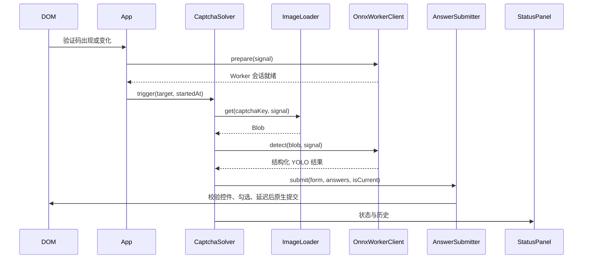

# 浏览器核心与用户脚本架构

本文面向修改 DOM、答案、Worker、模型或面板的维护者。安装与设置见[用户脚本指南](../usage/userscript.md)和[共享行为](../usage/settings.md)，扩展上下文差异见[扩展运行时](extension-runtime.md)。共享核心不直接调用 GM 或 WebExtension API，平台在入口注入能力。

## 状态所有权

| 对象                       | 拥有的状态                                     | 结束条件                                 |
| -------------------------- | ---------------------------------------------- | ---------------------------------------- |
| App                        | 当前/准备中/失败目标、页面取消信号、凭证修订号 | 新目标、切页、Key 变化或销毁使旧任务失效 |
| CaptchaSolver              | 一轮图片获取、识别、结果与耗时                 | 仅当前目标可记录完成或进入提交           |
| AnswerSubmitter            | 控件快照、自动勾选归属                         | 每次点击及最终提交前重查目标与归属       |
| OnnxWorkerClient           | 会话、初始化、串行检测队列                     | 取消、超时恢复或销毁释放请求与 Worker    |
| StatusPanel / HistoryStore | 面板节点、渲染代际、历史追加及持久化           | 迟到写入不得复活销毁节点或覆盖新状态     |

## 组装路径

用户脚本从 [main.ts](../../apps/userscript/src/main.ts) 开始：页面仍在加载时等待 `DOMContentLoaded`，否则立即初始化；非 BFCache 的 `pagehide` 调用销毁。入口 App 继承核心 [App](../../packages/browser-core/src/app/app.ts)，只负责把 `createAppDependencies` 组装的信号所有者接回核心。

依赖组装位于 [apps/userscript/src/app/app-dependencies.ts](../../apps/userscript/src/app/app-dependencies.ts)：

```text
App
 ├─ StatusPanel(HistoryStore, gmSettingsStorage)
 ├─ ModelCache(用户脚本 downloadModel)
 ├─ OnnxWorkerClient(Blob Worker factory)
 ├─ CachedImageLoader
 ├─ AnswerSubmitter(设置存储提供的延迟)
 └─ CaptchaSolver(panel, detector, imageLoader, submitter, answer mode, abort signal)
```

核心服务只依赖接口。例如 [AppDependencies](../../packages/browser-core/src/app/app-dependencies.ts)、[DetectorService](../../packages/browser-core/src/inference/inference-types.ts)、[StatusPanel contract](../../packages/browser-core/src/status-panel/status-panel-types.ts) 和 [SettingsStorage](../../packages/browser-core/src/platform/storage.ts) 定义了核心与平台的接缝。维护时先确认接口属于哪一层，再决定修改核心行为还是平台适配。

## 验证码生命周期与取消

[core App](../../packages/browser-core/src/app/app.ts) 观察页面上验证码目标相关的 DOM 变化，使用启动延迟和 MutationObserver 防抖调度扫描。它保存当前、失败和准备中的目标，并在销毁、页面切换、Key 变化时推进取消信号或凭据修订号。

一次自动处理的主链路是：



`CaptchaTarget` 在模型准备前捕获解析后的 `form.action`、原生提交控件的实际 action 和控件类型，`App` 与 `CaptchaSolver` 在准备、图片、推理和提交阶段通过 `isSameCaptchaTarget` 复核该地址及控件身份。地址变化会使旧任务失效；相对与绝对写法解析到同一 URL 时仍是同一目标。取消、超时或新目标到达后，旧任务不能继续点击或提交。答案提交器在开始和等待后再次确认表单 action、checkbox 数量、节点身份、所属表单、连接状态和禁用状态；相关约束集中在 [answer-submitter.ts](../../packages/browser-core/src/captcha/answer-submitter.ts)。

保留答案时，程序自动勾选和用户手动勾选通过 WeakMap 与 change 监听区分；超过上限时只按置信度移除自动项。手动模式只记录识别结果，不自动提交。随机兜底由 [CaptchaSolver](../../packages/browser-core/src/captcha/captcha-solver.ts) 的配置控制，修改时必须同时检查提交测试和 App 级取消测试。

多选等待期间，用户可能先于程序勾选下一项。提交器只为本轮实际点击成功的项或原本带自动标记的项更新置信度，不能因为答案出现在识别候选中就接管手动项。后续同一表单的识别与合并仍须保留这项手动身份。最终提交等待结束后，提交器会重新读取实际选中状态；总数超过 4 时只移除当前仍属自动的低置信度项，直到至多 3 项或已无自动项可移除。用户已取消的答案不会被重新勾选；初始裁剪与最终裁剪都须在每次点击前重查自动归属，避免页面 `change` 回调将下一项转为手动后仍被清除。每次点击后仍须复核目标。控件快照包括类型、有效禁用状态和原生提交控件的实际 action；`fieldset` 的继承禁用状态与 `formaction` 覆写均参与校验。

## 推理 Worker 与 Runtime profile

核心 [onnx-worker-client.ts](../../packages/browser-core/src/inference/onnx-worker-client.ts) 管理 Worker 的创建、初始化共享、检测串行队列、超时恢复、失败会话重建和销毁。待处理检测使用可移除队列：取消时立即移除尚未开始的项并释放图片；已开始的任务仍完成或按取消宽限终止后才运行下一项。销毁会立即拒绝全部排队项。它不决定 Worker 如何创建；`WorkerFactory` 由平台注入。

核心 [onnx-worker-entry.ts](../../packages/browser-core/src/inference/onnx-worker-entry.ts) 执行 Worker 内部协议：严格验证 `unknown` 请求、初始化 Runtime、创建可复用的 OffscreenCanvas/CHW 缓冲、执行 WASM 推理、解析输出并回传结构化消息。[worker-request-bridge.ts](../../packages/browser-core/src/inference/worker-request-bridge.ts) 在主线程验证响应、管理 request id 和超时。

用户脚本的 [onnx-worker-client.ts](../../apps/userscript/src/inference/onnx-worker-client.ts) 注入 [blob-worker.ts](../../apps/userscript/src/inference/blob-worker.ts) 创建的 Worker，并把构建时内联的脚本文本交给它。两个入口分别是：

- [onnx-worker-external-entry.ts](../../apps/userscript/src/inference/onnx-worker-external-entry.ts)：有界下载、校验外置 Runtime JS/WASM，校验成功后才通过 `importScripts`，并限制启动排队请求数。
- [onnx-worker-bundled-entry.ts](../../apps/userscript/src/inference/onnx-worker-bundled-entry.ts)：使用构建时提供的 Runtime glue，再通过 [runtime-wasm-loader.ts](../../apps/userscript/src/inference/runtime-wasm-loader.ts) 校验 Runtime WASM。

构建脚本 [build-userscript.mjs](../../apps/userscript/scripts/build-userscript.mjs) 选择 profile、把 Worker bundle 内嵌到主脚本、从 metadata 模板注入包版本，并可输出构建清单。资产身份和 profile 约束以 [onnx-runtime-assets.mjs](../../apps/userscript/scripts/onnx-runtime-assets.mjs) 与 [docs/onnx-runtime.md](../onnx-runtime.md) 为准，本文不重复具体数值。

## 模型下载、缓存和存储

核心 [model-downloader.ts](../../packages/browser-core/src/model/model-downloader.ts) 负责请求初始化、Bearer Key、重定向拒绝、响应状态、流式有界读取、完整性验证和下载确认回执。用户脚本 [model-downloader.ts](../../apps/userscript/src/model/model-downloader.ts) 只增加用户脚本 Key 来源和调用者/超时 AbortSignal 的组合，实际协议仍由核心负责。

[ModelCache](../../packages/browser-core/src/model/model-cache.ts) 编排缓存读取、共享下载、写入和确认；[indexeddb-model-store.ts](../../packages/browser-core/src/model/indexeddb-model-store.ts) 管理事务和生命周期；[model-cache-record.ts](../../packages/browser-core/src/model/model-cache-record.ts) 校验记录；[shared-model-downloads.ts](../../packages/browser-core/src/model/shared-model-downloads.ts) 合并同一时刻的网络下载。对带下载确认回执的远程模型，内容与待确认元数据先在同一事务落盘；确认成功并将匹配元数据改为已确认后，后续读取才允许命中。没有确认回执的路径不会额外发送确认请求。关闭或 `versionchange` 必须取消数据库操作和共享下载。

用户脚本模型 Key 走 [model-settings.ts](../../apps/userscript/src/model/model-settings.ts) 与 [sensitiveGmSettingsStorage](../../apps/userscript/src/userscript/gm-storage.ts)。普通设置使用 `gmSettingsStorage`；Key 使用敏感存储，GM API 不可用时拒绝写入页面可读的 localStorage。历史由 [answer-history-store.ts](../../apps/userscript/src/persistence/answer-history-store.ts) 注入 `userscriptHistoryStorage`，按前缀无缓存枚举同源 localStorage，复用核心 HistoryStore 的独立键追加、校验与排序。枚举先取得 key 快照，再跳过已被其他标签删除的值；有效旧根键只读保留，不再用整份 JSON 读改写新增历史。读取最多返回每世界 50 条，独立键在稳定追加后裁剪到 50；并发期间可暂时多存，旧根兼容数据也可能继续保留在底层。

缓存策略、`GET /quota`、`POST /quota`、确认时机和 `no-store` 约束请只在[模型缓存专题](../model-cache-strategy.md)维护。不要在平台适配器中复制额度或缓存状态机。

## 状态面板与历史

核心 [status-panel.ts](../../packages/browser-core/src/status-panel/status-panel.ts) 管理生命周期、状态、历史突变代次、异步设置回写和 `div#csp` 可见性观察；[status-panel-renderer.ts](../../packages/browser-core/src/status-panel/status-panel-renderer.ts) 使用安全 DOM API 渲染，不应新增 `innerHTML` 或动态代码执行。历史条数由设置约束；持久化期间先显示乐观结果，保存失败后回滚到已保存历史并显示错误，未保存条目不会继续留在面板。异步存储可通过 `getCommittedItemsByPrefix()` 提供已提交快照，HistoryStore 仅在破坏性裁剪时使用它；扩展镜像的未决写入不会挤掉旧记录，快照读取失败时跳过删除。用户脚本同步存储继续使用普通前缀枚举。

面板的 DOM 观察器独立于 csp 可见性开关，观察 documentElement 中的 body 及其子节点变化。AADB 等脚本移除 `.ponyLog` 时，将原面板重新挂到当前 body，不重新创建应用或加载历史；body 暂时缺失时等待后续变化。渲染也先核对挂载，再判断内容缓存并消费自身 mutation，避免跳过待处理的外部移除。destroy 断开观察并清空节点引用，后续 mutation、渲染或异步设置回调不能重建已销毁面板。

[HistoryStore](../../packages/browser-core/src/persistence/answer-history-store.ts) 为新记录分配每世界独立的 `sequence` 正安全整数，取本实例已分配序号与当前可见记录序号的最大值加一。分配发生在异步写入前，失败允许留下序号空洞；重建实例后从已保存记录恢复顺序。独立键历史按序号、时间戳和稳定 key 排序后裁剪；旧记录缺少序号时仍按原时间戳规则读取，非枚举存储的旧数组继续保持原顺序。显示用的 `timestamp`/`time` 不做单调化，也不重写旧数据。尚未互相观察到的并发写可使用同一序号，再按时间戳和 key 确定顺序；之后看到这些写入的新记录会取得更大序号。非法序号按损坏记录处理，安全整数上限耗尽则通过保存失败通道报告，不写入溢出值。

App 每轮在 `prepareTarget()` 前捕获当前页面的 `performance.now()`，经 `SolverService.trigger(target, startedAt)` 传给 Solver。新历史的 `elapsed` 计入准备与重试，自动模式截至原生提交点击，手动模式截至记录结果；开始扫描前的加载、防抖和提交后的网络响应不计入。Solver 独立统计图片获取和识别请求耗时，并在目标仍有效时统一写入“完成 Nms”，供用户脚本与扩展共用。持续时间按整数毫秒记录，历史时刻仍由 `Date.now()` 生成；旧历史不重新计算。修改时应覆盖准备重试、系统校时、新目标重置、取消和 DOM 替换。

用户脚本 [status-panel.ts](../../apps/userscript/src/status-panel/status-panel.ts) 只把 HistoryStore 和 GM 设置存储传给核心。修改面板默认位置、显示条件、紧凑模式或历史上限时，同时检查 [panel-settings.ts](../../packages/browser-core/src/status-panel/panel-settings.ts)、用户脚本对应设置文件、核心/用户脚本面板测试和 README/专题文档。

## 目录导航

目录已经按领域分组，新增源码应继续放入已有领域目录，避免把大量文件堆在 `src` 根目录。`index.ts` 是公开聚合入口，不是新业务代码的放置位置。

| 目录                                               | 所有者        | 主要职责                                                      | 首要测试目录                              |
| -------------------------------------------------- | ------------- | ------------------------------------------------------------- | ----------------------------------------- |
| `packages/browser-core/src/app`                    | 核心          | 页面观察、调度、生命周期、取消                                | `packages/browser-core/test/app`          |
| `packages/browser-core/src/captcha`                | 核心          | 目标定位、图片读取、答案选择、提交和设置契约                  | `packages/browser-core/test/captcha`      |
| `packages/browser-core/src/inference`              | 核心          | 图像预处理、Worker 协议、推理客户端和输出解析                 | `packages/browser-core/test/inference`    |
| `packages/browser-core/src/model`                  | 核心          | 模型下载、完整性、IndexedDB 缓存和下载确认                    | `packages/browser-core/test/model`        |
| `packages/browser-core/src/persistence`            | 核心          | 历史校验、限额、排序、旧根键与 keyed 记录兼容读取及损坏值清理 | `packages/browser-core/test/persistence`  |
| `packages/browser-core/src/platform`               | 核心接口/原语 | 存储、Fetch、字节流等可注入平台能力                           | `packages/browser-core/test/platform`     |
| `packages/browser-core/src/status-panel`           | 核心          | 状态、历史和安全 DOM 渲染                                     | `packages/browser-core/test/status-panel` |
| `packages/browser-core/src/utils`                  | 核心          | 取消竞态、延迟、错误格式化、日志和类型守卫                    | `packages/browser-core/test/utils`        |
| `apps/userscript/src/app`                          | 用户脚本适配  | 组装核心服务和入口 App                                        | `apps/userscript/test/app`                |
| `apps/userscript/src/userscript`                   | 用户脚本平台  | GM 桥接、敏感存储、菜单和 metadata                            | `apps/userscript/test/userscript`         |
| `apps/userscript/src/inference`                    | 用户脚本适配  | Blob Worker、Runtime profile 和核心 Worker 的装配             | `apps/userscript/test/inference`          |
| `apps/userscript/src/model`                        | 用户脚本适配  | 用 GM Key 和用户脚本 Fetch 组装核心模型服务                   | `apps/userscript/test/model`              |
| `apps/userscript/src/status-panel` / `persistence` | 用户脚本适配  | 注入 GM 设置存储和历史存储                                    | 对应同名测试目录                          |
| `apps/userscript/scripts`                          | 构建/资产门禁 | esbuild 构建、metadata 注入、Runtime/模型验证                 | 脚本旁的 `*.test.mjs`                     |

公开聚合导出见 [browser-core/src/index.ts](../../packages/browser-core/src/index.ts)，深层入口以 [browser-core/package.json](../../packages/browser-core/package.json) 的显式 exports 为准。需要平台专用实现时，应优先新增用户脚本目录中的薄适配器，避免在聚合入口加入宿主判断。

## 测试地图与验证边界

核心和用户脚本测试目录按源码领域镜像组织。核心 `vitest` 默认使用 jsdom；用户脚本 `vitest` 也使用 jsdom，脚本门禁另由 Node test 执行。用户脚本唯一的 Playwright 浏览器目录是 `test/e2e`，当前配置只声明 Chromium 项目；这不能证明 Firefox、不同用户脚本管理器或真实 Model Worker 的行为。

| 变更                     | 最小测试                                                                                   | 还应关注                                          |
| ------------------------ | ------------------------------------------------------------------------------------------ | ------------------------------------------------- |
| App 调度、目标替换、销毁 | `browser-core/test/app`, `userscript/test/app`                                             | `CaptchaSolver`、E2E smoke                        |
| 勾选、保留答案、原生提交 | 两个包的 `test/captcha/answer-submitter.test.ts`                                           | 表单替换和取消场景                                |
| Worker 协议、超时、恢复  | 两个包的 `test/inference`                                                                  | 用户脚本 Blob Worker 与两个 Runtime 入口          |
| 下载、完整性、缓存事务   | `browser-core/test/model`、`userscript/test/model`                                         | `docs/model-cache-strategy.md`、Model Worker 契约 |
| GM 存储和设置菜单        | `userscript/test/userscript`                                                               | 敏感 Key 不落到 page-readable storage             |
| 面板和历史               | 两个包的 `test/status-panel` 与 `test/persistence`                                         | csp 可见性、重新挂载、异步设置和持久化失败        |
| 构建/metadata/资产       | `apps/userscript/scripts/*test.mjs`、`apps/userscript/test/userscript-build-smoke.test.ts` | 构建产物审计和包体预算                            |

常用验证命令：

```bash
mise exec -- pnpm --filter @hv-pony-solver/browser-core test
mise exec -- pnpm --filter @hv-pony-solver/userscript test
mise exec -- pnpm --filter @hv-pony-solver/browser-core typecheck
mise exec -- pnpm --filter @hv-pony-solver/userscript typecheck
mise exec -- pnpm docs:check
```

上述测试主要证明模拟 DOM、Worker、Fetch、存储和构建门禁；它们不自动证明真实页面、真实 GM 管理器、真实远程模型鉴权或浏览器多引擎兼容性。涉及这些边界时，在报告中单独列出已运行的 E2E 和未覆盖项。

## 推理参数权威入口

[inference-config.ts](../../packages/browser-core/src/inference/inference-config.ts) 是以下参数的唯一源码来源，调用者不得另设隐式常量：

| 配置                     | 字段与当前行为                                                                                                                       |
| ------------------------ | ------------------------------------------------------------------------------------------------------------------------------------ |
| `imagePreprocessConfig`  | `imageSize=640`；图片编码最多 2 MiB，边长最多 4096，像素最多 16000000                                                                |
| `yoloOutputConfig`       | `rowSize=6`、`confidenceIndex=4`、`classIndex=5`；`confidenceThreshold=0.3`、`maxDetections=16`、`maxKinds=3`；输出最多 100000 行    |
| `inferenceTimeoutConfig` | `workerInitTimeoutMs=60000`、`workerDetectTimeoutMs=30000`、`modelDownloadTimeoutMs=30000`；取消宽限、探测和缓存超时同样由该对象维护 |
| `prepareDeadlineConfig`  | Worker、内容端与 Broker 的期限逐层留出结算余量；扩展协议不能复制另一份期限                                                           |

输入在浏览器内转换为 640×640 CHW Float32，YOLO 输出映射到 shared 的答案码。修改参数后同时核对预处理、输出 guard、两平台 Worker 和截止时间测试。

## 维护入口

新增平台能力先调整核心接口，再在平台入口组装；薄适配器不是仅凭行数即可删除的重导出。涉及取消或并发时先锁定状态所有者，补行为回归，再拆分模块。注释、类型、格式和导出规范统一见[贡献指南](../development/contributing.md)，避免各架构页维护不同规则。
