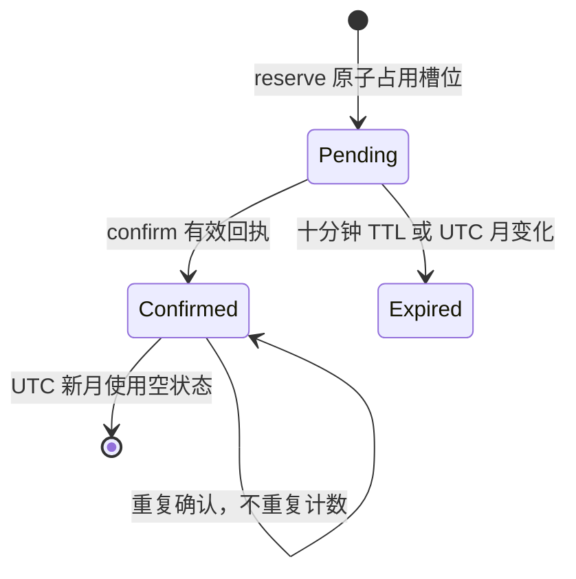

# Model Worker 与共享契约

Model Worker 只承担 Key 鉴权、模型/运行时分发与每 Key 下载额度，不接收验证码或答案。本文解释内部顺序和持久状态；精确方法、响应矩阵与 CORS 见[HTTP 契约](../reference/model-worker-http.md)，配置与部署见[运维手册](../model-worker-ops.md)。

## 组件边界与目录

```text
apps/model-worker/
├── src/
│   ├── index.ts                 Worker fetch 入口与 Durable Object 导出
│   ├── request-router.ts        路由、方法分支、处理流程编排
│   ├── model-access.ts          Authorization Bearer 解析与 KV 授权
│   ├── model-response.ts        响应头、CORS、缓存和错误响应
│   ├── asset-integrity.ts       R2 元数据完整性预检
│   ├── model-download-quota.ts 额度 Durable Object 与调用客户端
│   ├── env.ts                   环境变量解析、校验和缓存
│   ├── request-timeout.ts       KV/R2/DO 依赖超时
│   ├── logger.ts                脱敏日志分类
│   └── worker-types.ts          Cloudflare 绑定的最小接口
├── test/                        Worker、DO、完整性和环境契约测试
└── scripts/                     Wrangler 渲染、部署契约与配置校验
```

`packages/shared` 是浏览器端与服务端共同使用的纯契约层，不能依赖 DOM、扩展 API、GM API 或 Cloudflare API。入口 [`packages/shared/src/index.ts`](../../packages/shared/src/index.ts) 汇总答案代码、访问令牌、旧 ONNX 清单、ORT 清单和运行时 WASM 清单；包配置同时以显式 exports 公开经过调用者盘点的领域子路径。`apps/model-worker` 只能从该包消费名称、路径、资产身份和协议常量；R2、KV、Durable Object 与请求对象均留在 Worker 内部。

## 请求入口与路由

`src/index.ts` 的 `worker.fetch` 将请求直接交给 `handleRequest`，同时导出 `ModelDownloadQuota` 供 Wrangler 的 Durable Object 类绑定使用。`src/request-router.ts` 先调用 `readWorkerConfig`，再按完整 pathname 与配置值精确匹配四类路由：

| 路由类别        | 默认路径来源                                          | 方法                     | 鉴权                                                            | 响应缓存/额度                                        |
| --------------- | ----------------------------------------------------- | ------------------------ | --------------------------------------------------------------- | ---------------------------------------------------- |
| 旧 ONNX 模型    | `DEFAULT_PUBLIC_MODEL_PATH`，默认 `/yolo26n-640.onnx` | `GET`、`HEAD`、`OPTIONS` | 模型 Key；无效 Key 由 `INVALID_KEY_MODE` 决定                   | `no-store`；仅真实 `GET` 在启用额度时预留回执        |
| ORT 模型        | `ORT_MODEL_PUBLIC_PATH`，默认 `/yolo26n-640.ort`      | `GET`、`HEAD`、`OPTIONS` | 同上                                                            | `no-store`；与旧模型共用同一 Key 额度                |
| 额度接口        | 默认 `/quota`                                         | `GET`、`POST`、`OPTIONS` | 必须是真实 Bearer Key，即使无效 Key 模式为 `decoy` 也不返回诱饵 | JSON `no-store`；`GET` 查询，`POST` 确认回执         |
| 公开运行时 WASM | `ORT_RUNTIME_WASM_PUBLIC_PATH`，文件名由内容身份决定  | `GET`、`HEAD`、`OPTIONS` | 无                                                              | `public, max-age=31536000, immutable`，允许 `*` CORS |

未匹配路径返回 404。OPTIONS 在业务处理前分支：模型和额度使用私有来源策略并声明对应方法/请求头，WASM 使用公开 `*` 策略。匹配路由但方法不允许时返回 405 和相应 `Allow`。路由顶层捕获异常，记录不含秘密的错误分类并返回通用 500；底层 KV、R2、DO 错误不会把 Key、摘要、对象身份或内部错误文本回显给客户端。

## 鉴权与 Key 边界

`src/model-access.ts` 只从 `Authorization` header 读取 `Bearer <token>`，不从 query string 获取 Key。请求 token 先经过 `normalizeModelAccessToken`，要求 64 位十六进制并转为小写 canonical token；`getModelAccessTokenLookupKeys` 再生成 canonical、原始混合大小写和历史大写变体的查询序列。KV 命中非空值即选择 `real`，否则根据配置返回 `decoy` 或 `forbidden`。

canonical token 的用途分开处理：KV 查询需要短期兼容历史大小写键，额度身份只使用 canonical token 的 SHA-256 摘要调用 `idFromName`。原始 Key、canonical Key、摘要和 KV 值都不得进入日志或响应。模型请求中的 query `key` 即使有效也不会授权真实对象；当 Authorization 无效时也不会回退到 query Key。

额度接口始终要求真实 Bearer Key，不复用模型路由的诱饵响应。扩展远程模型下载在完整读取、校验并成功写入缓存后，才使用响应中暴露的回执调用 `POST /quota`；这条客户端时序由浏览器核心实现，Worker 只负责服务端预留和确认。

## 响应职责

[model-response.ts](../../apps/model-worker/src/model-response.ts) 集中生成响应。模型、额度和公开 WASM 分别使用自己的 CORS 方法、允许头与来源策略；新路由不得合并成过宽的全局策略。模型及错误 no-store，公开内容寻址 WASM 可长期 immutable；HEAD/OPTIONS 不计额度。完整头字段与 400/403/405/409/429/500/503 含义由 [HTTP 矩阵](../reference/model-worker-http.md#响应矩阵)维护。

## R2 对象完整性与响应顺序

模型路由先完成 Key 决策，再选择真实对象键或 decoy 对象键。真实模型和公开 WASM 在把对象交给响应前调用 `hasExpectedR2ObjectIntegrity`：`R2Object.size` 必须等于 shared 清单中的 `byteLength`；如果 R2 记录了 SHA-256，则必须与清单匹配（大小写不敏感）；校验元数据读取异常直接失败关闭。既有对象缺少 R2 SHA-256 元数据时，Worker 允许继续，但浏览器下载器仍须校验实际字节。

真实模型 GET 在额度启用时先只读查询 DO status：已确认额度耗尽返回 429，查询失败返回 503，均不读取 R2。预检优先于对象检查，也不预留槽位；未耗尽的正常下载多一次 DO 查询，待确认槽位是否占满仍由后续 reserve 决定。

通过预检后，对象不存在、真实元数据漂移或 GET 对象缺少 body 都返回通用 500；公开 WASM 的对象与完整性错误也返回 500。完整性失败会先取消可读 body；取消失败也不能覆盖完整性错误。模型 GET 创建响应后，只有真实模型、GET 且额度启用时才进入 DO reserve；reserve 仍原子复核已确认及待确认数量，拒绝时取消响应 body，再返回 429/503，因此不会把未获额度的模型 body 留在流中。reserve 成功才附加回执并交给客户端。

资产契约导航：

- 旧 ONNX：[`packages/shared/src/model.ts`](../../packages/shared/src/model.ts)
- ORT 模型：[`packages/shared/src/ort-model.ts`](../../packages/shared/src/ort-model.ts)
- ORT/WASM 路径与对象键：[`packages/shared/src/ort-assets.ts`](../../packages/shared/src/ort-assets.ts)
- 内容寻址 WASM：[`packages/shared/src/ort-runtime.ts`](../../packages/shared/src/ort-runtime.ts)
- Worker 环境默认值与绑定：[`apps/model-worker/wrangler.template.toml`](../../apps/model-worker/wrangler.template.toml)

替换任一资产时，必须同步清单、Worker 模板/渲染器、R2 对象、客户端下载契约、测试和相关文档；不要在调用方复制长度或哈希。

## 额度 Durable Object：reserve/confirm 与 TTL 清理状态

当前实现没有 `cancel` 端点，也没有客户端可调用的取消协议。未确认的预留由 TTL 到期清理；这只是存储清理机制，不能视为一次协议 cancel 或客户端回滚。DO 的状态按 canonical token 的 SHA-256 摘要隔离，每个身份独占一个 SQLite-backed Durable Object 实例。

状态键是 `monthly-download-quota-v2`，状态结构为：

```text
{
  month: "YYYY-MM",
  used: number,                         // 已确认下载数
  pending: { receiptId: expiresAtMs },  // 未确认预留
  confirmed: string[]                   // 已确认回执，保证幂等
}
```

状态只接受当前契约：月份格式有效，`used` 不超过 shared 的月上限，`confirmed.length === used`，回执必须是 32 位小写十六进制且不得重复，`pending + used` 不超过月上限。发现损坏状态会失败关闭并保留原始值，不自动修复或静默清零。



上图没有客户端 cancel 状态；本地取消不撤销已经处理的确认。

### Reserve

`POST /reserve` 在 DO 事务内先按当前时间清理已过期 pending。`used >= limit` 返回 `quota-exhausted`；已确认数加 pending 数达到上限返回 `reservations-full` 和最早过期时间；否则生成不重复的随机回执，将 `expiresAt = now + 10 分钟` 写入 pending。reserve 只占槽位，不增加 used，不计月度确认次数。

### Confirm

`POST /confirm` 必须带合法回执 header，并在同一事务内处理。已在 `confirmed` 的回执返回 `confirmed=true, alreadyConfirmed=true`，不重复计数；仍在 pending 的回执被删除、`used` 加一并追加到 confirmed；未知、过期或月额度已满的回执返回 `confirmed=false`，不增加 used。顶层 `/quota` 将失败确认映射为 409，避免伪造成功。

### Status 与月边界

内部 `POST /status` 只读当前状态并返回 limit/used/remaining；它不创建持久状态。UTC 月份变化时使用空状态开始新月；旧月的 pending 和 confirmed 不迁移。未启用额度时，顶层 `/quota` 返回 `enabled=false`、`remaining=null`，不会访问 DO；格式正确的 POST 明确返回 409，缺失/畸形回执仍先返回 400。

## Shared 契约导航

| 模块             | 导出内容                                                 | 使用边界                             |
| ---------------- | -------------------------------------------------------- | ------------------------------------ |
| `answer.ts`      | `ANSWER_CODES`、`AnswerCode`、class id 映射              | 浏览器推理与答题，不进入 Worker 路由 |
| `token.ts`       | 64 位十六进制验证、canonical 化、历史 KV lookup keys     | Worker 鉴权与浏览器 Key 设置         |
| `model.ts`       | 旧 ONNX 文件名、版本、完整性、月度上限、回执 header/解析 | Worker、客户端下载与额度协议         |
| `ort-model.ts`   | ORT 文件名与完整性                                       | ORT 模型下载和 R2 预检               |
| `ort-runtime.ts` | 内容寻址 WASM 文件名、长度、SHA-256                      | 公开运行时下载和构建审计             |
| `ort-assets.ts`  | ORT/WASM public path 与 R2 object key                    | Worker 配置默认值和客户端 URL        |

Shared 目前按领域文件拆分，入口统一 re-export。资产身份是成组契约：源 ONNX 与其 ORT 构建需从同一导出重新生成，不能只改其中一个哈希或长度。仓库现有用户脚本/扩展构建器、完整性校验和发布脚本已经对实际模型、glue 与 WASM 执行长度和 SHA-256 校验；本页只导航这些既有门禁，不把 shared 常量测试误述为唯一的 artifact 审计。

## 改动与测试矩阵

| 改动                           | 最小验证                                                                                               | 必须补看的边界                                                    |
| ------------------------------ | ------------------------------------------------------------------------------------------------------ | ----------------------------------------------------------------- |
| 路由、HTTP 方法、CORS 或响应头 | `apps/model-worker/test/http-cors.test.ts`、`quota-http.test.ts`                                       | 两个受信 Origin、未知 Origin、无 Origin、OPTIONS/HEAD、404/405    |
| Bearer 解析或 KV 兼容          | `apps/model-worker/test/http-cors.test.ts`、`quota-http.test.ts`、`packages/shared/test/token.test.ts` | query 不授权、大小写历史键、invalid-key `decoy/error`、无秘密错误 |
| 资产长度/哈希/对象键           | `model-runtime-assets.test.ts`、`packages/shared/test/ort-assets.test.ts`                              | GET 与 HEAD、缺对象、缺 SHA 元数据、漂移失败关闭                  |
| reserve/confirm/状态或月边界   | `model-download-quota.test.ts`、`quota-http.test.ts`                                                   | 并发、重复确认、TTL、UTC 月切换、跨模型共用额度、存储故障         |
| 环境变量或 Wrangler 绑定       | `env.test.ts`、`scripts/*wrangler*.test.mjs`                                                           | 缺失值、路径/对象键冲突、DO 类/迁移保持、quota 开关               |
| DO/依赖超时与错误脱敏          | `failure-timeout.test.ts`、`request-timeout.test.ts`、`model-download-quota.test.ts`                   | KV/R2/DO hang、取消 body、日志不含 token/摘要/对象身份            |
| Shared 协议常量                | `packages/shared/test/*.test.ts` 及受影响 Worker 测试                                                  | 客户端 URL、Worker 默认值、文档漂移和构建产物                     |

推荐验证顺序是先运行修改包的定向测试，再运行 `mise exec -- pnpm --filter @hv-pony-solver/model-worker test`、`mise exec -- pnpm --filter @hv-pony-solver/shared test`，最后执行根级 `mise exec -- pnpm check` 与 `git diff --check`。修改部署配置前，按运维手册用测试占位变量渲染 Wrangler 配置；不要把生产 Key、Cloudflare 凭据或真实对象标识写入测试。

## 运维入口

部署前后的 workflow、dry-run 与生产门禁见 [`docs/model-worker-ops.md`](../model-worker-ops.md)。本地配置渲染和部署脚本位于 `apps/model-worker/scripts/`，其中 `wrangler.template.toml` 是配置权威来源，生成的 `wrangler.toml` 和 `.wrangler/` 属于生成物。运维手册中的公开契约探测使用不带凭据和 body 的 OPTIONS/HEAD probe，真实模型鉴权与推理仍需单独验收；模型真实 body、Key、KV 值、R2 标识和 DO 身份不能进入日志或记录。
