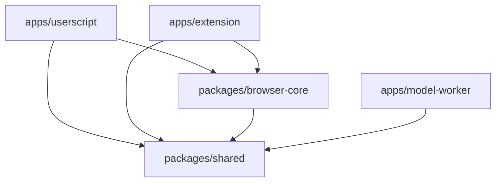

# 整体架构与职责边界

项目由三个应用和两个内部包组成。浏览器负责验证码图片预处理、模型推理、答案选择和提交；Cloudflare 服务负责模型授权与分发。图片和识别结果不进入模型服务。

## 依赖关系

图中箭头表示允许的应用源码依赖方向，不表示所有模块都需要直接依赖目标包。构建脚本另有读取资产和清单的关系，例如扩展构建复用用户脚本的定制 Runtime 资产；这种构建关系不授权应用之间直接导入业务源码。

| 单元           | 负责                                                            | 能力从哪里来                                      | 不应承担                             |
| -------------- | --------------------------------------------------------------- | ------------------------------------------------- | ------------------------------------ |
| `shared`       | 答案码、Key 格式、模型与 WASM 身份、额度协议常量                | 纯 TypeScript 数据和函数                          | DOM、网络、存储及任何平台实现        |
| `browser-core` | 页面调度、目标身份、勾选提交、推理、模型缓存、面板与历史        | 平台接口、工厂、可注入 Fetch/存储；标准浏览器 API | GM 或 WebExtension API、平台入口选择 |
| `userscript`   | 用户脚本启动、GM 能力、设置菜单、Blob Worker 和 Runtime profile | 用户脚本管理器及浏览器                            | 扩展后台和 Cloudflare 绑定           |
| `extension`    | 内容脚本、消息、后台/Offscreen、设置页、远程/内置 Host 和打包   | WebExtension API、扩展源存储、包内资产            | 向内容脚本提供模型 Key 或模型二进制  |
| `model-worker` | Bearer/KV 鉴权、R2 响应、每 Key 下载额度和 CORS                 | Cloudflare KV、R2、Durable Object                 | 图片识别、答案选择或浏览器状态       |

当前内部包同时提供根入口和经过调用者盘点的显式子路径导出。新增文件不会自动成为公共接口；移动已公开的核心源码仍会影响调用方。目录和迁移记录见[目录方案](../development/directory-layout.md#共享包导出边界)。

## 运行链路

页面入口创建共享核心 App。App 定位验证码并调度本轮处理；Solver 读取图片、调用 Detector，再依据配置交给提交器。提交器在操作前后复核目标和控件身份，防止页面切换后的旧任务继续点击。面板接收状态与有上限的历史记录；可见性独立于识别是否运行。

平台差异集中在 Detector 和持久化能力的组装上：

| 平台/模式         | 推理承载位置            | 模型来源                        | Runtime 来源                   | 设置与 Key                                        |
| ----------------- | ----------------------- | ------------------------------- | ------------------------------ | ------------------------------------------------- |
| 用户脚本 external | Blob Web Worker         | 模型服务；浏览器 IndexedDB 缓存 | 校验后的固定外置 JS/WASM       | GM 普通设置与敏感 Key 适配                        |
| 用户脚本 bundled  | Blob Web Worker         | 同上                            | 内置 glue；首方下载并校验 WASM | 同上                                              |
| 扩展 remote       | Host 创建 module Worker | 模型服务；扩展源 IndexedDB 缓存 | 扩展包内 JS/WASM               | 普通设置 `storage.local`；Key 独立 IndexedDB      |
| 扩展 packaged     | Host 创建 module Worker | 包内固定模型                    | 扩展包内 JS/WASM               | 普通设置 `storage.local`；不构建 Key/远程下载能力 |

Chromium Host 在 Offscreen Document 中运行，Firefox Host 由 background script 持有。`bundled` 描述用户脚本 Runtime 的构建方式，`packaged` 描述扩展模型的交付方式，二者不能互换。

## 数据边界与所有权

验证码图片只在页面、内容客户端、Host 和推理 Worker 的浏览器链路中传递。扩展图片消息使用有明确上限的 Base64 以适应 JSON 消息边界；模型在 Host 与 Worker 间使用可转移 `ArrayBuffer`。修改这两条链路时分别核对消息大小与缓冲区所有权，不能把图片的传输方式直接套用到模型。

模型缓存和额度确认是两个独立系统的协作。Worker 的模型 GET 只预留回执；客户端下载、验证实际字节并完成本地缓存事务之后，才确认下载。二进制和确认元数据必须绑定同一次缓存写入，迟到的确认不能覆盖另一份模型。完整流程以[模型缓存策略](../model-cache-strategy.md)和[服务端状态机](model-service.md#额度-durable-objectreserveconfirm-与-ttl-清理状态)为准。

日志与状态广播只携带必要的非敏感状态；Key、内部对象身份和完整模型数据不应进入这些通道。远程与内置能力隔离既是代码组装边界，也是构建产物审计边界。

## 权威模块与变更入口

| 要改变的契约             | 源码/配置入口                                                                                                                                                                            | 必须联动核对                                   |
| ------------------------ | ---------------------------------------------------------------------------------------------------------------------------------------------------------------------------------------- | ---------------------------------------------- |
| 客户端版本与构建命令     | [用户脚本包](../../apps/userscript/package.json)、[扩展包](../../apps/extension/package.json)                                                                                            | metadata、ZIP/清单、README、发布门禁           |
| Node/pnpm 版本           | [mise.toml](../../mise.toml)、[根 package.json](../../package.json)                                                                                                                      | CI、版本契约测试、环境说明                     |
| 工作区依赖和公开子路径   | [browser-core 包](../../packages/browser-core/package.json)、[shared 包](../../packages/shared/package.json)                                                                             | 所有调用方、TS 配置、架构检查                  |
| 图片尺寸、解析和推理超时 | [inference-config.ts](../../packages/browser-core/src/inference/inference-config.ts)                                                                                                     | 预处理、Worker、扩展截止时间、测试             |
| 答案保留和提交安全       | [answer-submitter.ts](../../packages/browser-core/src/captcha/answer-submitter.ts)                                                                                                       | 设置、Solver、表单替换/取消测试                |
| 面板默认值与可见性       | [panel-settings.ts](../../packages/browser-core/src/status-panel/panel-settings.ts)                                                                                                      | 两个平台设置、面板测试、README                 |
| 历史记录格式与持久化     | [answer-history-store.ts](../../packages/browser-core/src/persistence/answer-history-store.ts)                                                                                           | 两个平台存储、外部写入、历史上限               |
| 模型和 WASM 身份         | [shared 入口](../../packages/shared/src/index.ts)、[Runtime 清单](../../apps/userscript/src/inference/onnx-runtime-assets.ts)                                                            | 构建器、客户端下载器、Worker 模板、资产与专题  |
| 缓存事务和确认           | [model-cache.ts](../../packages/browser-core/src/model/model-cache.ts)、[IndexedDB store](../../packages/browser-core/src/model/indexeddb-model-store.ts)                                | quota 协议、并发写入、取消和元数据测试         |
| 扩展消息与截止时间       | [protocol facade](../../apps/extension/src/protocol/messages.ts)、[protocol modules](../../apps/extension/src/protocol/)、[deadlines.ts](../../apps/extension/src/protocol/deadlines.ts) | content、options、Broker、Offscreen、Host、E2E |
| HTTP 路由与响应头        | [request-router.ts](../../apps/model-worker/src/request-router.ts)、[model-response.ts](../../apps/model-worker/src/model-response.ts)                                                   | Worker 测试、客户端、README、漂移检查、运维    |
| 下载额度持久状态         | [model-download-quota.ts](../../apps/model-worker/src/model-download-quota.ts)                                                                                                           | 状态迁移、幂等、TTL、UTC 月边界、回滚契约      |
| 部署绑定与迁移           | [wrangler.template.toml](../../apps/model-worker/wrangler.template.toml)                                                                                                                 | 渲染器、DO 类导出、工作流与运维                |

## 扩展一个功能的落点

新增平台通用的识别行为，先在核心的领域目录实现，并通过已有接口提供平台能力。新增平台 API 交互，放在对应应用适配层。新增纯协议常量时再评估 `shared`；不要因为两个文件都用到某个值就把平台行为移到共享包。

公共设置变更通常横跨核心默认值、用户脚本菜单、扩展设置页和内容存储镜像。模型变更横跨共享清单、下载校验、打包、服务端配置和发布证据。以表格列出的维护入口追踪影响，比按应用逐个复制逻辑更容易保持一致。

详细流程见[浏览器运行时](browser-runtime.md)、[扩展运行时](extension-runtime.md)、[Model Worker](model-service.md)，验证命令见[开发与验证](../development/verification.md)。
