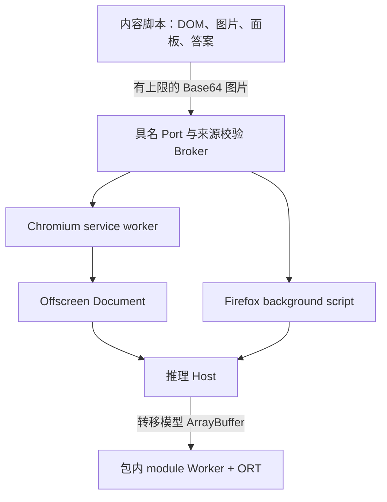

# 浏览器扩展

本页覆盖扩展的构建、安装、权限、存储和发布证据。共享答题规则见[设置与行为](usage/settings.md)，内部时序见[扩展运行时](architecture/extension-runtime.md)。扩展版本来自 [apps/extension/package.json](../apps/extension/package.json)，当前为 `0.1.1`；清单、ZIP、artifact 与 Release 标签都从该值派生。

## Scope

| 目标             | 浏览器          | 最低版本            | 模型交付          | 验证边界                                    |
| ---------------- | --------------- | ------------------- | ----------------- | ------------------------------------------- |
| Chromium MV3     | Chrome、Edge    | Chromium 116        | remote / packaged | 独立执行精确最低桌面 major                  |
| Firefox MV3      | Firefox Desktop | Firefox 140         | remote / packaged | 独立执行精确最低桌面 major                  |
| 同一 Firefox ZIP | Firefox Android | Firefox Android 142 | remote / packaged | 内置模型 artifact 发布要求外部 Android 证据 |

Safari、其他移动浏览器、Manifest V2、商店签名和商店资料不在当前构建范围内。桌面 Firefox 版本高于 142 也不能证明 Android 兼容；远程桌面 Release 不声称 Android 已验证。不要在同一浏览器配置中同时启用用户脚本版和扩展版。

## Build modes

从仓库根目录执行，先按[验证手册](development/verification.md)准备依赖。

| 模式           | 命令                                                                  | 模型来源                                   | Key        |
| -------------- | --------------------------------------------------------------------- | ------------------------------------------ | ---------- |
| `remote`，默认 | `mise exec -- pnpm --filter @hv-pony-solver/extension build`          | `https://models.ngnl.host/yolo26n-640.ort` | 运行时需要 |
| `packaged`     | `mise exec -- pnpm --filter @hv-pony-solver/extension build:packaged` | 固定本地输入 `model/yolo26n-640.ort`       | 不使用     |

工作区内的直接 CLI 为 `node scripts/build/build-extension.mjs --model-mode remote` 或 `--model-mode packaged`。模式在构建时确定，运行时不自动探测或回退。**两种模式共用并重建 `apps/extension/dist/`**；单次构建只留下所选模式的 ZIP。

生产内置构建只接受固定输入，不接受路径或完整性覆盖。清理旧 dist 前先拒绝缺失、非普通文件、符号链接、长度不是 9,914,448 或 SHA-256 不符的模型。构建不通过 Key 临时下载模型。模型可从安装包提取，完整性保护不提供加密或保密性。

构建入口把配置、权限策略、资产验证、产物审计、归档和目标编排委托给 `scripts/build/`。ZIP 以有界分块流式压缩并增量计算哈希，固定时间戳与排序支持相同输入的可重复产物。构建器和 geckodriver 安装器在递归清理前，拒绝仓库、cwd、home 本身及其祖先路径，临时目录与符号链接解析后的路径同样受检查。

## Build outputs and local loading

```text
apps/extension/dist/
├── chromium/
├── firefox/
├── hv-pony-solver-chromium-<version>.zip           remote
├── hv-pony-solver-firefox-<version>.zip            remote
├── hv-pony-solver-chromium-packaged-<version>.zip  packaged
├── hv-pony-solver-firefox-packaged-<version>.zip   packaged
├── *.zip.sha256
└── *.artifact.json
```

上表是两种构建的产物并集，不表示一次构建同时生成四个 ZIP。当前版本把 `<version>` 替换为 `0.1.1`。每个目标目录和 ZIP 内部结构如下：

```text
<browser-target>/
├── manifest.json
├── build-manifest.json
├── background/background.js
├── content/content.js
├── options/
│   ├── options.html
│   ├── options.js
│   └── options.css
├── offscreen/                       仅 Chromium
│   ├── offscreen.html
│   └── offscreen.js
├── runtime/
│   ├── inference-worker.js          含精简 ORT glue
│   └── ort-wasm-simd-<sha256>.wasm
└── model/yolo26n-640.ort             仅 packaged
```

[`EXTENSION_PATHS`](../apps/extension/src/platform/extension-paths.ts) 统一维护 `background/background.js`、`content/content.js`、`options/options.html`、`options/options.js`、`options/options.css`、`offscreen/offscreen.html`、`offscreen/offscreen.js` 和 `runtime/inference-worker.js`。HTML 资源相对于页面目录解析，扩展 API URL 相对于包根解析。模型和 WASM 路径身份继续由 shared 清单维护。

`build-manifest.json` 记录 `modelDelivery` 和逐文件身份；packaged 还记录模型长度与哈希。artifact 元数据绑定 ZIP。fixture 构建额外记录 `expected.classId` 和 `expected.confidence`，E2E 必须与该 oracle 一致。生成目录、ZIP、证据和本地模型不作为普通源码提交。

本地加载：

1. Chrome 打开 `chrome://extensions`，Edge 打开 `edge://extensions`，启用开发者模式，加载 `apps/extension/dist/chromium`。
2. Firefox 打开 `about:debugging#/runtime/this-firefox`，临时加载 `apps/extension/dist/firefox/manifest.json`。
3. 点击工具栏按钮进入 `options/options.html`；它是设置页，不是 popup。
4. remote 验证并保存 Key；packaged 直接使用包内模型。更新时完整替换构建目录并重新加载，避免混用旧文件。

## Permission matrix

| 目标/模式         | API 权限               | Host 权限              | Firefox 数据声明     |
| ----------------- | ---------------------- | ---------------------- | -------------------- |
| Chromium remote   | `storage`、`offscreen` | Hentaiverse 与模型服务 | 不适用               |
| Chromium packaged | `storage`、`offscreen` | Hentaiverse            | 不适用               |
| Firefox remote    | `storage`              | Hentaiverse 与模型服务 | `authenticationInfo` |
| Firefox packaged  | `storage`              | Hentaiverse            | `none`               |

remote 的 Key 作为 Bearer 凭据发送至模型服务，因此 Firefox 声明 `authenticationInfo`。任何模式都不请求 `<all_urls>`、tabs、scripting、cookies、debugger 或 unlimited storage，也不声明 `web_accessible_resources` 或图片资源。

扩展页面 CSP 为 `script-src 'self' 'wasm-unsafe-eval'; object-src 'none'; worker-src 'self'`。所有可执行 JS、module Worker、精简 ORT glue 和 WASM 随包分发。动态导入、远程可执行 `.js`/`.mjs`/`.wasm` 引用或资产哈希漂移会使构建审计失败。remote 包不能含 `.ort`；packaged 必须且只能含清单指定的一个模型。

## Runtime architecture



内容脚本不接收 Key 或模型字节。验证码图片仅在浏览器上下文间传递，使用 JSON-safe Base64，最大 2 MiB，并严格限制 MIME。HTTP Content-Type 先验证再规范化为小写基础 MIME；跨上下文协议仍使用精确白名单。Firefox 隔离世界使用 `FileReader.readAsDataURL()` 读取 Blob，避免依赖可能被拒绝的 `Blob.arrayBuffer()`。

模型用可转移 `ArrayBuffer`，不用 Base64 或分片。Worker 创建 WASM Execution Provider 会话并串行推理。两个模式的内容脚本相同：观察 DOM、同源读取图片、呈现历史、点击答案和原生提交。

已有答题历史时内容端会静默预热会话；首次安装保持按需加载，不在首个验证码前消耗下载槽位。只有非静默的 prepare/detect 活动期间，Host 阶段与断连消息才更新该内容页的推理状态。

每个内容 Port 最多保留两个 detect 和两个并行 prepare；后台全局最多六个 detect、四个 prepare。这些计数随后台代际重置，不是整个浏览器会话的永久限额。取消只影响指定请求；尚未开始的 detect 立即从队列移除并释放图片，运行中的请求结算或终止后才执行下一项。

Chromium 的 Offscreen claim 仅在同一后台 epoch 与 `contextId` 内复用，并发等待者共享握手但独立取消。超时、失败、文档替换或后台重启要求重新 claim；每次后台启动都安排空闲协调，避免遗留会话无人回收。Firefox 直接持有 Host，清单不写不受支持的 `background.persistent`。细节见[扩展运行时](architecture/extension-runtime.md)。

## Model and runtime ownership

remote Host 组装下载器、模型 IndexedDB、独立 Key IndexedDB 和 Key 验证能力。模型有界下载后校验长度及 SHA-256，缓存成功后才确认回执；完整状态机见[缓存专题](model-cache-strategy.md)。

packaged Host 不构造这些远程能力，不打开或修改原 Key 存储，不声明模型 Host 权限。它用 `force-cache`、`redirect: error` 读取扩展内部模型 URL，检查状态、十进制安全 Content-Length、流上限、精确长度与 SHA-256。确定性模型/WASM 完整性错误跨 Worker 保留永久错误分类，不对不变的损坏资产自动重试，也不回退远程下载。

## Storage and options

| 数据           | remote             | packaged        | 内容页可见性     |
| -------------- | ------------------ | --------------- | ---------------- |
| 模型字节       | 模型 IndexedDB     | 包内文件        | 不可见           |
| 模型 Key       | 独立秘密 IndexedDB | 不读、不改      | 不可见           |
| 普通设置与历史 | `storage.local`    | `storage.local` | 通过内存镜像读取 |

内容存储镜像只保留应用命名空间，包含两个世界的历史以支持预热。初始化先监听再读快照，按 key 保留最早旧值和最新新值；5 秒超时、取消、超过 1024 个不同缓冲 key 或快照读取失败都会清理监听器并失败。最多维护四个前缀索引。

历史解析缓存只在序列化值相同时复用，返回副本，并保留写入后的最终校对。破坏性裁剪读取已提交快照，不让乐观未决写入挤掉旧记录；读取失败或不完整时跳过删除。面板会恢复挂载到当前 body，并在清除自身 mutation 前处理外部移除；完整历史与可见性规则见[设置说明](usage/settings.md)。

remote 设置页在绑定处理器后才启用 Key 控件，已保存 Key 不回显：

| 操作         | 行为                                                                        |
| ------------ | --------------------------------------------------------------------------- |
| 验证并保存   | HEAD 验证，不计下载；事务完成后保存                                         |
| 查询下载次数 | 用已保存 Key 只读查询；关闭限制时显示“无次数限制（模型下载次数限制未开启）” |
| 下载模型     | 用已保存 Key 下载、验证、缓存和确认；有效缓存命中不重复计次                 |
| 清除 Key     | 删除 Key；不宣称撤销已经提交的事务或服务端确认                              |

验证/清除完成时只清空点击后未编辑的输入；相同文字重新输入也视为编辑。Key 的原生事务提交独立触发 Host 取消并等待旧的未完成初始化，再通知 Broker 更新凭证修订号，包括静默预热与其他 Port 消费者。调用方取消仍报告取消，但不能撤销已提交的变更；事务回滚不通知，Host 关闭后的迟到回调不重启同步，已就绪会话可复用。

页面销毁取消待处理操作。错误保留 Host、HTTP、超时或浏览器的实际原因；只有额度查询会对瞬时 Port 断开重连一次，验证和下载不自动重放。

packaged 设置页不打开 Key Port，Key 控件禁用并显示“当前版本已内置模型，无需配置模型 Key。”，普通设置仍可修改。

## Script and test entry points

包内 Node 测试使用 `node --test "scripts/**/*.test.mjs"`，覆盖 build、benchmark、browser、E2E、fixture 与 release 契约。脚本按这七个职责目录组织，日常使用包命令。

benchmark 的聚合入口只显式转发契约：参数在 `benchmark-config.mjs`，统计在 `benchmark-statistics.mjs`，结果 schema 在 `benchmark-result.mjs`，比较在 `benchmark-comparison.mjs`，CSV 在 `benchmark-csv.mjs`；runner 只编排浏览器与采样。每次 invocation 至少两个测量样本，`--samples 1` 在启动浏览器前拒绝。完整成本和产品基准限制见[命令参考](development/commands.md)。

浏览器完整版本比较只删除末尾零：`140.15.0` 等同 `140.15`，不等同 `140.15.1`。最低支持和精确最低执行使用 [browser-support.mjs](../apps/extension/scripts/browser/browser-support.mjs) 的 major 策略。

## Validation and release evidence

先运行类型、单元测试和内容 fixture：

```bash
mise exec -- pnpm --filter @hv-pony-solver/extension typecheck
mise exec -- pnpm --filter @hv-pony-solver/extension test
mise exec -- pnpm --filter @hv-pony-solver/extension test:e2e:content
```

远程产物先构建，再执行 load-only；`test:e2e:chromium` 是 Chromium load-only 的别名：

```bash
mise exec -- pnpm --filter @hv-pony-solver/extension build
mise exec -- pnpm --filter @hv-pony-solver/extension test:e2e:chromium:load-only
mise exec -- pnpm --filter @hv-pony-solver/extension test:e2e:firefox:load-only
```

受保护环境已经注入 `KvKey`，且明确启用真实鉴权验收时，针对同一远程构建运行：

```bash
mise exec -- pnpm --filter @hv-pony-solver/extension test:e2e:chromium:authenticated
```

缺少 Key 必须失败。不要把 Key 写入命令行、日志或证据。

内置模型是另一组产物，重新构建后再验收：

```bash
mise exec -- pnpm --filter @hv-pony-solver/extension build:packaged
mise exec -- pnpm --filter @hv-pony-solver/extension test:e2e:packaged
```

没有 canonical 模型时可运行根 `mise exec -- pnpm test:e2e:extension:packaged`，它构建确定性 fixture 并执行双浏览器验收。fixture 不证明 canonical 模型准确率，且会覆盖 dist。

| 检查                       | 证明内容                                                 | 不证明             |
| -------------------------- | -------------------------------------------------------- | ------------------ |
| 单元/构建测试              | 协议、权限、取消、资产、可重复归档                       | 浏览器实际执行     |
| content fixture            | 页面答题、消息、一次原生提交                             | 真实 ORT/模型      |
| Chromium/Firefox load-only | 远程包加载、普通设置；Firefox 核对当前 Key/额度/下载控件 | 鉴权下载与推理     |
| authenticated Chromium     | 有效 Key 下载校验后至少一次真实 detect，关闭随机回退     | 内置模型、商店发布 |
| packaged Chromium          | 校验 ZIP 与元数据，解压并只加载该临时树，两次成功推理    | Edge/商店验收      |
| packaged Firefox           | WebDriver 安装已校验的实际 ZIP，两个新会话成功推理       | AMO 签名、Android  |

内置证据 schema 2 绑定 archive 名称/长度/SHA-256、解压树哈希、模型身份、浏览器版本、成功结果类型、checkbox index 和 confidence。fixture 必须匹配 oracle，随机兜底结果被拒绝。Chromium 不用工作区 dist 替代受测 ZIP，Firefox 直接安装 ZIP。

`REQUIRE_EXACT_MINIMUM_BROWSER=true` 要求真正运行 Chromium 116 或 Firefox Desktop 140，高版本不能替代。Chromium 116 在 Xvfb 下使用 `PACKAGED_E2E_HEADLESS=false`，该变量只接受 true/false。Firefox 需要 geckodriver（或 `GECKODRIVER_PATH`）及 openssl，并清理自建证书、代理和会话。CI 固定 geckodriver `0.37.1` 与压缩包 SHA-256；安装器在 60 秒总期限内最多尝试三次，仅重试网络和 HTTP 408/429/5xx，归档、哈希、路径或版本错误直接失败。

### Firefox Android 142 external release gate

仓库 CI 不自动运行 Android。独立 harness 必须在 Android major 142 安装同一 canonical Firefox ZIP，关闭随机回退并至少成功推理一次。外部 run 上传命名 artifact `hv-pony-solver-firefox-android-142-evidence`，包含 `firefox-android-142-evidence.json`，其 `kind` 为 `firefox-android-142-packaged-e2e`，记录设备、Android 版本、浏览器、模型身份、精确 ZIP 身份和成功推理观察。

发布内置 artifact 时设置 `publish_extension_artifact=true` 与 `firefox_android_e2e_run_id`。门禁校验成功的外部 run、可信 workflow/事件/commit 和同一 ZIP 身份。缺证据、版本不符、随机回退或 archive 不一致均阻止发布。缺 `PACKAGED_MODEL_URL` 时 canonical 门禁跳过，不能发布内置 artifact。

### GitHub desktop Release

从 main 手动设置 `publish_extension_release=true`，创建 `extension-v<version>`，当前为 `extension-v0.1.1`，附远程 Chromium/Firefox ZIP、SHA-256 和 artifact 元数据。已存在标签或非 main 被拒绝，只有最终发布 job 拥有写权限；它复用已经测试的远程产物。

两类扩展发布均要求本次 CodeQL job 成功、仓库检查、桌面 smoke、内置 fixture、最低桌面版本与受保护远程推理门禁。`production-model-smoke` 环境提供 `KV_KEY`；缺少凭据或未启用会跳过鉴权并阻止发布，不能以 HEAD 验证替代 detect。CodeQL 执行成功不代表没有安全告警。

普通 push/PR 不发布；GitHub Release 不等同商店签名或 Android 验收。全部输入、工作流与交付边界见[CI 与发布](development/releases.md)。
